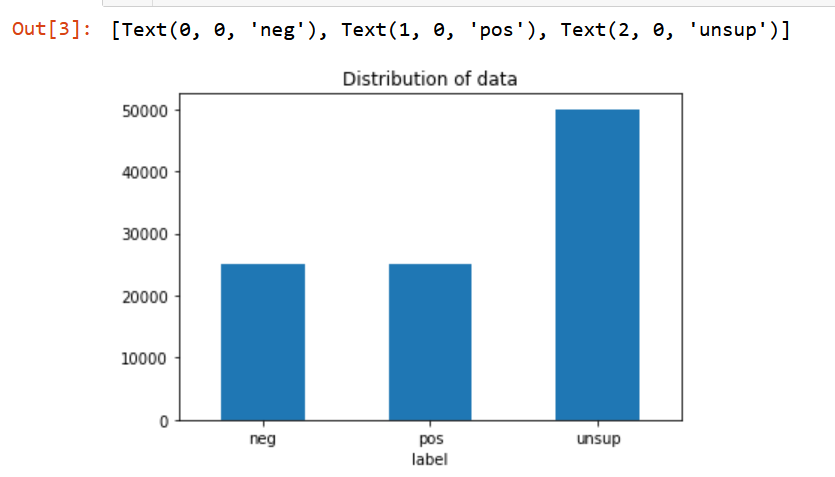
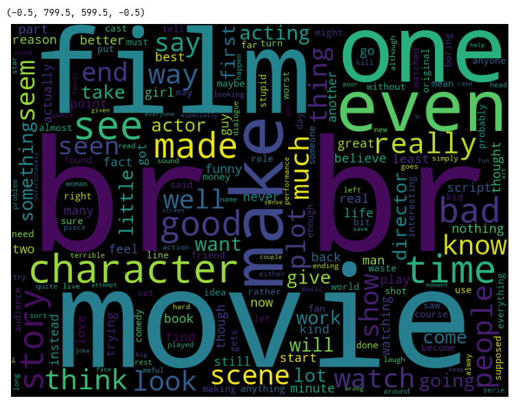
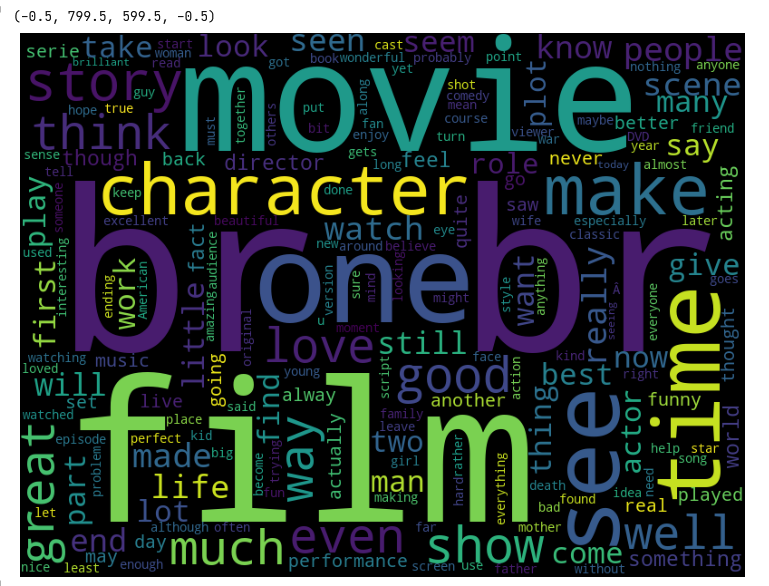
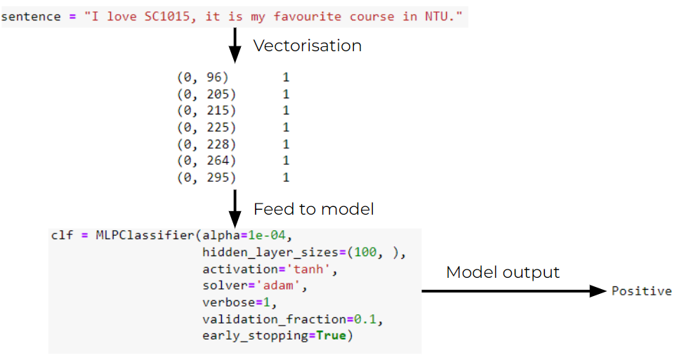
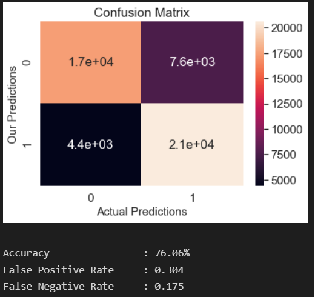

# Welcome to Movie Review Sentiment Analysis Repository

## About

This is a Mini Project for SC1015 (Introduction to Data Science and Artificial Intelligence) of Nanyang Technological University (NTU).

This project focuses on sentiment analysis of reviews from IMDB, using Natural Language Processing (NLP) with `sklearn`. For detailed walkthrough, please view the notebooks in the follwing order:

1. [P1_data_preparation.ipynb](./P1_data_preparation.ipynb)
2. [P2_classification_model.ipynb](./P2_classification_model.ipynb)

## Requirements

These notebooks utilises some external libraries, please run the following command line in your terminal in the current working directory to install the libraries.

> pip install -r requirements.txt

Or run the first code cell of the notebooks to install the libraries.

## Table of Contents

1. [Problem Definition and Motivation](#problem-definition-and-motivation)
2. [Datasets](#datasets)
3. [How we approach our problems](#how-we-approach-our-problems)
4. [Exploratory Data Analysis](#exploratory-data-analysis)
5. [Neural Netowrk Model](#neural-network-model)
6. [Outcome](#outcome)
7. [What we had learnt](#what-we-had-learnt)
8. [Conclusion](#conclusion)
9. [Demo](#demo)
10. [References](#references)

## Problem Definition and Motivation

How can we predict a movie's rating (positive or negative) solely based on its review?

## Datasets

We used a couple of datasets for training and testing purposes, which are the [IMDB review dataset from kaggle](https://www.kaggle.com/datasets/utathya/imdb-review-dataset) and another [control IMDB dataset from kaggle](https://www.kaggle.com/datasets/lakshmi25npathi/imdb-dataset-of-50k-movie-reviews) as a benchmark for our model.

We went ahead and cleaned the datasets to our needs and save it into a separate zipped csv file.

- [imdb_master_cleaned.csv](./datasets/imdb_master_cleaned.zip)
- [IMDB_dataset_cleaned.csv](./datasets/IMDB_dataset_cleaned.zip)

## How we approach our problems

| Problems | Our solution |
| :------: | ------------ |
| Long training time | We tried reducing the amount of input features for our model by removing words that did not appeat frequent enough, by doing so we can train our model in a couple minutes. |
| Long dataset preprocessing time | We saved the processed dataset into a csv file so we can just load the cleaned dataset whenever we need to use it in the future. |

## Exploratory Data Analysis

- We used `matplotlib`, `wordcloud`, `seaborn` and other modules to help us visualise the data we had in hand.

### Distribution of review sentiment in our dataset

Half of our data are unlabelled.

### Common words (a.k.a stopwords) in negative and positive reviews

Many commonly used words that does not represent the sentiment at all.

## Neural Network model

- We tried training the model using `sklearn`'s many already pre-built model, such as [`sklearn.nerual_network.MLPRgressor`](https://scikit-learn.org/stable/modules/generated/sklearn.neural_network.MLPRegressor.html) and [`sklearn.naive_bayes.MultinomialNB`](https://scikit-learn.org/stable/modules/generated/sklearn.naive_bayes.MultinomialNB.html), we ended using `sklearn`'s neural network Multi-Layer Preceptron [`sklearn.neural_network.MLPClassifier`](https://scikit-learn.org/stable/modules/generated/sklearn.neural_network.MLPClassifier.html) as our machine learning model on classifying the movie reviews into positive or negative, as it yields the best results compared to the rest.

## Outcome

- After optimising the parameters of our model, we managed to get a maximum of around 76% accuracy on our control dataset.

- We had save the model into our `pretrained_models` directory for future use. Here are more details on the score of the model.

## What we had learned

- We learnt to preprocess textual data before starting to make and train the machine learning model.

- We also learnt how to use `sklearn`'s Multi-Layer Perceptron Classifier in machine learning.

- How to re-use a previously trained machine learning model.

## Conclusion

- Machine Learning can be used for Natural Language Processing, and for predicting the positive and negative sentiment of movie reviews, in spite of the accuracy not being really high.

- Natural Language Processing is very well-suited to handling and analysing raw human text data. In this project we were able to get hands on quickly processing large quantities of movie reviews to obtain an overall sentiment of it. In the age of Big Data where machines are expected to seamlessly deliver insights to the collective data generated by everyone on the internet, applications like these allow businesses and movie-goers to get a basic estimate of the impressions toward a movie. Despite the limited results that were obtained, we hope to create a good foundation to explore other tools to provide deeper insights on movie reviews and understand the complex human emotions that lie behind their words.

## Demo

We can go to [the demo file](./demo.ipynb) to test our pretrained model on the test dataset. There, we can even input our own movie review (and label) to test our machine learning model.

## References

1. [Kaggle IMDB review dataset](https://www.kaggle.com/datasets/utathya/imdb-review-dataset)
2. [Kaggle IMDB control dataset](https://www.kaggle.com/datasets/lakshmi25npathi/imdb-dataset-of-50k-movie-reviews)
3. [scikit-learn working with text data](https://scikit-learn.org/stable/tutorial/text_analytics/working_with_text_data.html)
